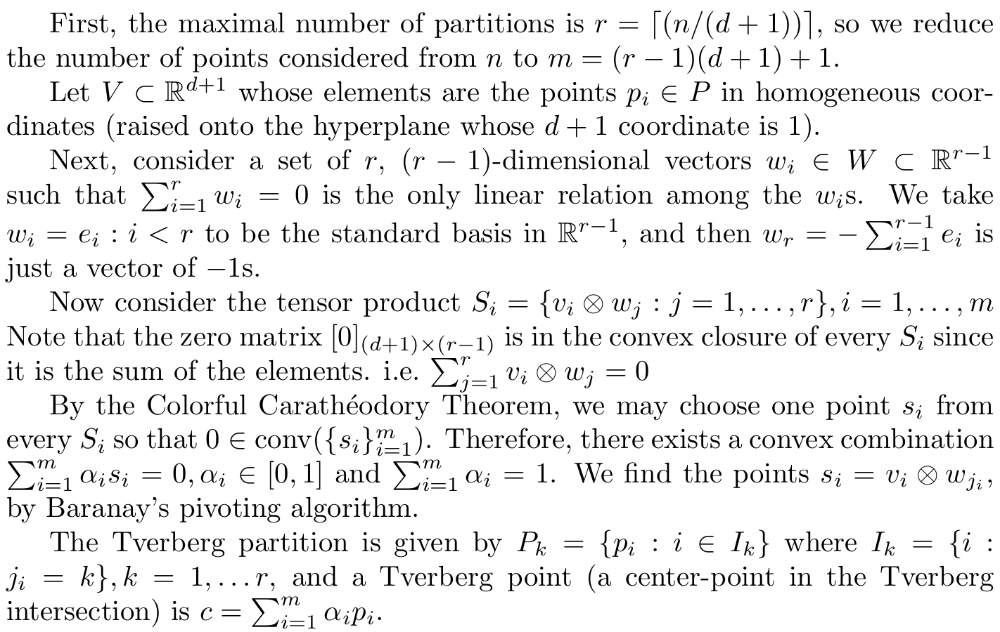

# viz-Tverberg
Visualizing Tverberg's theorem in the plane.

The following python3 packages are needed:
	numpy,
	scipy,
	matplotlib,
	cvxpy
	
	
A Tverberg partition of a point set is found via Sarkaria's
proof of Tverberg's theorem. Sarkaria's proof is essentially
a polynomial time reduction of Tverberg's problem to finding
a colorful Carathéodory set in a higher dimensional space.
The colorful Carathéodory set is found via Barany's pivoting
algorithm.

Tverberg, H. (1966). A generalization of Radon's theorem. Journal of the London Mathematical Society, 1(1), 123-128. https://doi.org/10.1112/jlms/s1-41.1.123

Sarkaria, K. S. (1992). Tverberg’s theorem via number fields. Israel journal of mathematics, 79(2), 317-320. https://doi.org/10.1007/BF02808223

Barany, I. (1982). A generalization of Carathéodory's theorem. Discrete Mathematics, 40(2–3), 141–152. https://doi.org/10.1016/0012-365X(82)90115-7

The basic procedure is as follows:

To demonstrate the progress of the algorithm, we use a generator function to yield the state before
each pivot step and plot the current partition of the given point set along with the current guess at a Tverberg point. Once the colorful set in the higher (m-1) dimensional space contains the origin in its convex closure, the algorithm terminates and a Tverberg partition has been found.