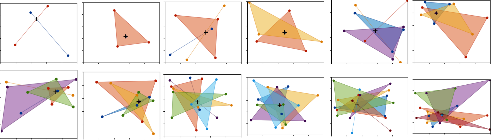
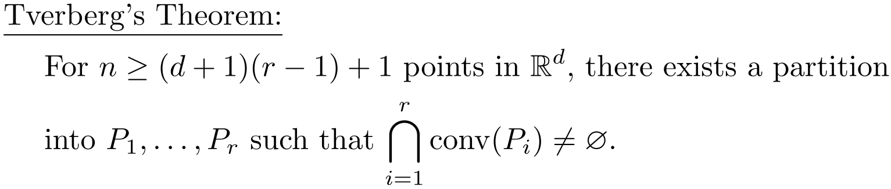

# viz-Tverberg
Visualizing Tverberg's theorem in the plane.

https://doi.org/10.1112/jlms/s1-41.1.123

The following python3 packages are needed:
	numpy
	scipy
	matplotlib
	cvxpy
	
What we plan to do:
Create program that takes as input n points within a rectangular grid, and returns a Tverberg partition of size r = ceil(n/(d+1)). This will be used to plot the convex hulls of each of the r partitioned sets in a different color, and a point in their intersection will be plotted in black.
